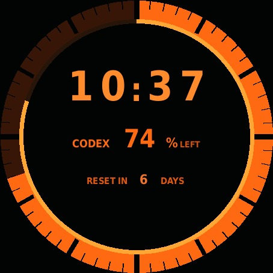

# OpenGT

Open companion and stock-watchface experimentation for the first-generation HUAWEI
WATCH GT (FTN-B19, platform codename **Fortuna**).

OpenGT currently turns a stock-format GT1 watchface into a Codex quota desk companion:

- exact weekly Codex quota remaining;
- a 10%-step quota bezel;
- reset countdown in days;
- a native, thin battery ring;
- current time;
- updates through Gadgetbridge without reinstalling the face, while the local sync process
  is running.



## Current status

The complete path has been physically validated on the project watch:

```text
Codex app-server
      |
scripts/opengt-sync
      |
ADB -> Gadgetbridge generic weather integration
      |
Huawei LPv2 / stock weather service
      |
OpenGT.hwt on FTN-B19
```

Gadgetbridge 0.92.2 pairs with the watch, installs and activates the custom HWT, and
updates its bound fields without another watchface upload. The current build is **0.8.0**.

The GT1 renderer has no custom variable API. OpenGT deliberately reuses three stock
weather values:

| Weather value | OpenGT meaning |
| --- | --- |
| current temperature | quota decile `0..10`, selecting one of 11 bezel images |
| maximum temperature | exact quota percentage shown as text |
| minimum temperature | days until quota reset |

The quota ring is therefore quantized to the nearest 10%, while the numeric percentage is
exact. The battery ring uses the watch's native battery ratio and does not depend on the
phone. This prototype replaces genuine weather values while active.

## Runtime model and limitations

**The current MVP is local and computer-assisted.** It is not a standalone watch app,
phone-only companion, or hosted service.

| Component | Must remain available for quota refreshes? |
| --- | --- |
| Computer | Yes: runs `codex` and `scripts/opengt-sync` |
| Internet on the computer | Yes: reads the authenticated Codex quota |
| ADB connection from computer to phone | Yes: USB or reachable wireless ADB |
| Gadgetbridge on the phone | Yes: receives the local broadcast and talks to the watch |
| Bluetooth connection from phone to watch | Yes: delivers the update |

The computer does **not** need to stay on for the watchface, clock, or battery ring to
work. When the computer or either connection is unavailable, the watch keeps showing the
last synchronized quota and reset values, which become stale. For automatic current
values, the computer must stay awake with the sync process running. OpenGT does not yet
include an Android companion, remote server, startup service, or cloud relay.

## Reproduce the MVP

### Requirements

The validated setup used the following. Other versions may work, but are not yet part of
the tested path.

- HUAWEI WATCH GT **FTN-B19**;
- Android phone with Bluetooth and USB or wireless debugging available;
- [Gadgetbridge](https://gadgetbridge.org/) **0.92.2**, paired with and currently connected
  to the watch;
- Linux computer (CachyOS was used for the end-to-end synchronization);
- Python 3.9 or newer;
- DejaVu Sans Condensed Bold at
  `/usr/share/fonts/truetype/dejavu/DejaVuSansCondensed-Bold.ttf` (`ttf-dejavu` on
  Arch/CachyOS or `fonts-dejavu-core` on Debian/Ubuntu);
- Android Debug Bridge (`adb`);
- [Codex CLI](https://developers.openai.com/codex/cli) authenticated with a ChatGPT account
  that has Codex access;
- internet access on the computer.

The synchronization path has not been packaged for Windows, macOS, iOS, or Huawei Health.
The passive BLE observer is separate and was validated on macOS.

### 1. Prepare the repository and tools

Install `codex` and `adb` using their official instructions or your operating system's
package manager, authenticate Codex, and then clone OpenGT:

```sh
git clone https://github.com/PiotrZadka/opengt.git
cd opengt
python3 -m venv .venv
.venv/bin/pip install -r requirements.txt

codex --version
adb version
```

Opening `codex` should show an authenticated session before continuing. OpenGT invokes the
local authenticated app-server; it never reads or copies the credential file.

### 2. Pair the watch in Gadgetbridge

Pair FTN-B19 from Gadgetbridge and wait until its device page reports **Connected**. The
phone must maintain this Bluetooth connection whenever a quota update is sent.

### 3. Connect the phone through ADB

Enable Android developer options and USB debugging, connect the phone, accept its debugging
prompt, and verify that exactly one usable device is listed:

```sh
adb devices
```

If several devices are listed, select one for each sync command:

```sh
ANDROID_SERIAL=<adb-serial> ./scripts/opengt-sync
```

For optional wireless ADB, first enable or pair it according to the phone's Android
version, then store its reported endpoint:

```sh
adb connect <phone-ip>:<adb-port>
mkdir -p ~/.config/opengt
printf '%s\n' '<phone-ip>:<adb-port>' > ~/.config/opengt/adb-serial
```

Wireless debugging can turn off or change ports after a phone restart; reconnect it before
running OpenGT again.

### 4. Build and install the watchface

```sh
PYTHONPATH=src .venv/bin/python scripts/build_opengt_watchface.py
adb push watchfaces/OpenGT/export/OpenGT.hwt /sdcard/Download/OpenGT.hwt
```

On the phone, open `OpenGT.hwt` with Gadgetbridge's FW/App installer. Confirm that it is
identified as an `HWHD02` 454×454 watchface, install it, and select it on the watch. The
stable local outputs are:

```text
watchfaces/OpenGT/export/OpenGT.bin
watchfaces/OpenGT/export/OpenGT.hwt
```

The builder starts from `watchfaces/OpenGT/base/OpenGT_0.1.0.bin`, a minimal GT1 payload
previously exported by Huawei WatchFace Designer. Subsequent layout, resources, bindings,
and packaging are generated locally by `src/opengt_watchface/builder.py`.

### 5. Verify one quota update

With Codex authenticated, ADB connected, Gadgetbridge running, and the watch connected:

```sh
./scripts/opengt-sync
```

A successful run prints the remaining quota, reset time, and `Watch: updated successfully`.
The watch can take a short time to redraw the new values.

### 6. Keep quota synchronized

Run the foreground poller every five minutes:

```sh
./scripts/opengt-sync --watch --interval 300
```

Keep that terminal, the computer, ADB, Gadgetbridge, and the phone-to-watch Bluetooth link
available. Stopping the process stops future quota refreshes; it does not remove or break
the watchface. No startup/background service is installed by this repository.

The synchronizer reads the authenticated Codex app-server RPC
`account/rateLimits/read`, selects the exact seven-day Codex window, and sends only the
three documented weather values through Gadgetbridge. It does not expose arbitrary BLE
writes.

## Passive BLE tooling

The original observer remains read-only:

```sh
PYTHONPATH=src .venv/bin/python scripts/ble_observe.py --scan-seconds 20
PYTHONPATH=src .venv/bin/python scripts/ble_observe.py --scan-seconds 30 --connect
PYTHONPATH=src .venv/bin/python scripts/ble_observe.py \
  --scan-seconds 30 --connect \
  --subscribe-notifications --notification-seconds 20
```

It scans with Bleak/CoreBluetooth, reads GATT characteristics, and can subscribe to FE02.
It never writes Huawei application packets.

## Tests

```sh
PYTHONPATH=src .venv/bin/python -m unittest discover -s tests -v
```

The suite covers the LPv2 codec, watchface geometry, GT1 data bindings, generated payload,
and HWT structure.

## Repository map

- `watchfaces/OpenGT/` — GT1 payload seed, generated resources, previews, and current build.
- `src/opengt_watchface/` — reproducible OpenGT watchface builder.
- `scripts/opengt-sync` — Codex-to-Gadgetbridge synchronization.
- `src/huawei_lpv2/` — offline LPv2 framing/TLV/slicing codec.
- `scripts/ble_observe.py` — passive BLE/GATT observer.
- `captures/` — reviewed physical-validation and GATT evidence.
- `research/` — source-backed protocol, firmware, OTA, and security findings.

## Research

- [Codex watchface feasibility and physical gate](research/codex-watchface-feasibility.md)
- [Custom firmware gap analysis](research/ftn-b19-custom-firmware-gap-analysis.md)
- [Firmware sources and OTA server](research/ftn-b19-firmware-sources-and-ota-server.md)
- [Huawei UUID and LPv2 protocol research](research/huawei-uuid-protocol.md)
- [Hardware and BLE baseline](docs/hardware-and-ble-baseline.md)
- [LPv2 codec notes](docs/lpv2-codec.md)

## Safety and scope

Ordinary pairing, notification/weather synchronization, passive observation, and
stock-format watchface operations are in scope. OTA, flashing, malformed payloads,
fuzzing, exploit work, and persistent modification require a separate explicit decision.
Opening or electrically probing the watch is out of scope.

See [AGENTS.md](AGENTS.md) before live-device or firmware work.

No license has been selected yet.
